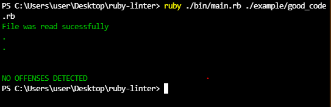
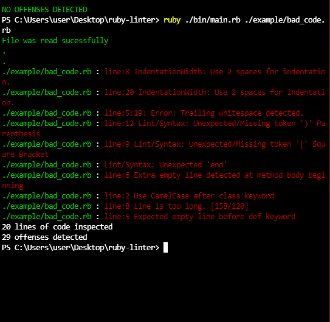
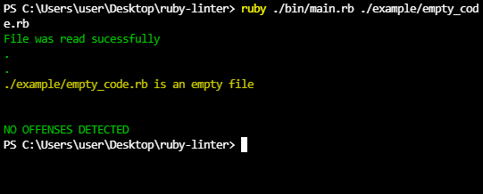

# Capstone Project - Ruby linter

## Game description📄

**This ruby linter** checks for the follwing errors/warnings: 
1. Check for trailing spaces
2. Check for the wrong indentation
3. Check for missing/unexpected tags i.e. '( )', '[ ]', and '{ }'
4. Check missing/unexpected end
5. Check empty line error
6. Check class names for CamelCase format
7. Check module names for CamelCase format
8. Check line length
9. Check space before methods

#### Below you can see good, bad and empty code examples and their test results on console

Good code passes this test successfully!👍
~~~ruby
# Good Code

class Board
  attr_reader :sets, :grid
  attr_accessor :selections

  def initialize
    @sets = [[1, 2, 3], [4, 5, 6], [7, 8, 9], [1, 4, 7], [2, 5, 8], [3, 6, 9], [1, 5, 9], [3, 5, 7]]
    @grid = "+---+---+---+\n| 1 | 2 | 3 |\n+---+---+---+\n| 4 | 5 | 6 |\n+---+---+---+\n| 7 | 8 | 9 |\n+---+---+---+"
    @selections = []
  end

  def insert(number, sym)
    @grid[@grid.index(number.to_s)] = sym
  end
end
~~~
Console uotput

Bad code passes this test unsuccessfully!👎
~~~ruby
# Bad Code

class board
  attr_reader :sets, :grid
  attr_accessor :selections
  def initialize   

    @sets = [[1, 2, 3], [4, 5, 6], [7, 8, 9], [1, 4, 7], [2, 5, 8], [3, 6, 9], [1, 5, 9], [3, 5, 7]]
      @grid = "+---+---+---+\n| 1 | 2 | 3 |\n+---+---+---+\n| 4 | 5 | 6 |\n+---+---+---+\n| 7 | 8 | 9 |\n+---+---+---+"+ "this line is longer than 120 characters"
    @selections = []]
  end

  def insert(number, sym
    @grid[@grid.index(number.to_s)] = sym
  end
end
end
~~~
Console uotput

Empty file shows warning to the user!👐
~~~ruby
# Emty Code

~~~
Console uotput

## Content

* [Necessary requirements](#necessary-requirements)
* [Getting started](#getting-started)
* [RSpec test Instructions](#rspec-test-instructions)
* [Built With](#built-with)
* [Getting Started](#getting-started)
* [Dependencies](#dependencies)
* [Contributing](#contributing)
* [Acknowledgments](#acknowledgments)
* [Author](#author)
* [License](#license)

## Necessary requirements

- gem install colorize
- gem install bundler

## Getting started
- open your terminal
- clone the repository `$ git clone https://github.com/AbdumurodovaZulfizar/ruby-linter.git`
- cd ruby-linter
- code . in the terminal
- open the downloaded repository with vscode.
- Run the command `$ ruby ./bin/main.rb ./folder/your_file.rb`
## RSpec test Instructions

<ol>
  <li>To test this project install RSpec, for it boot up your terminal and punch in `gem install rspec` to install RSpec.</li>
  <li>`cd` into ruby-linter project directory</li>
  <li>Type `rspec`</li>
</ol>

## Built With

- <code></code> Ruby Language  
- &nbsp; Git 
- &nbsp; GitHub 
- &nbsp; VScode

## Author

👩🏻‍💼 **Zulfizar Abdumurodova**

- GitHub: [Abdumurodova Zulfizar](https://github.com/AbdumurodovaZulfizar)
- Twitter: [Abdumurodova Zulfizar](https://twitter.com/Zulfiza70357085)
- LinkedIn: [Abdumurodova Zulfizar](https://www.linkedin.com/in/zulfizar-abdumurodova-a61527206/)

### Dependencies

Ruby 3.0.1

### Contributing

Contributions, issues and feature requests are welcome!

You can do it on [issues page](https://github.com/AbdumurodovaZulfizar/ruby-linter/issues/4).

## Show your support

Give a ⭐️ if you like this project!

## Acknowledgments

- [Microverse](https://www.microverse.org/) for international opportunities.
- Special thanks to all code reviewers.

## 📝 License

Copyright 2021 Zulfizar Abdumurodova
- [MIT](https://github.com/AbdumurodovaZulfizar/ruby-linter/blob/build_linter/LICENSE.md) for this project.
